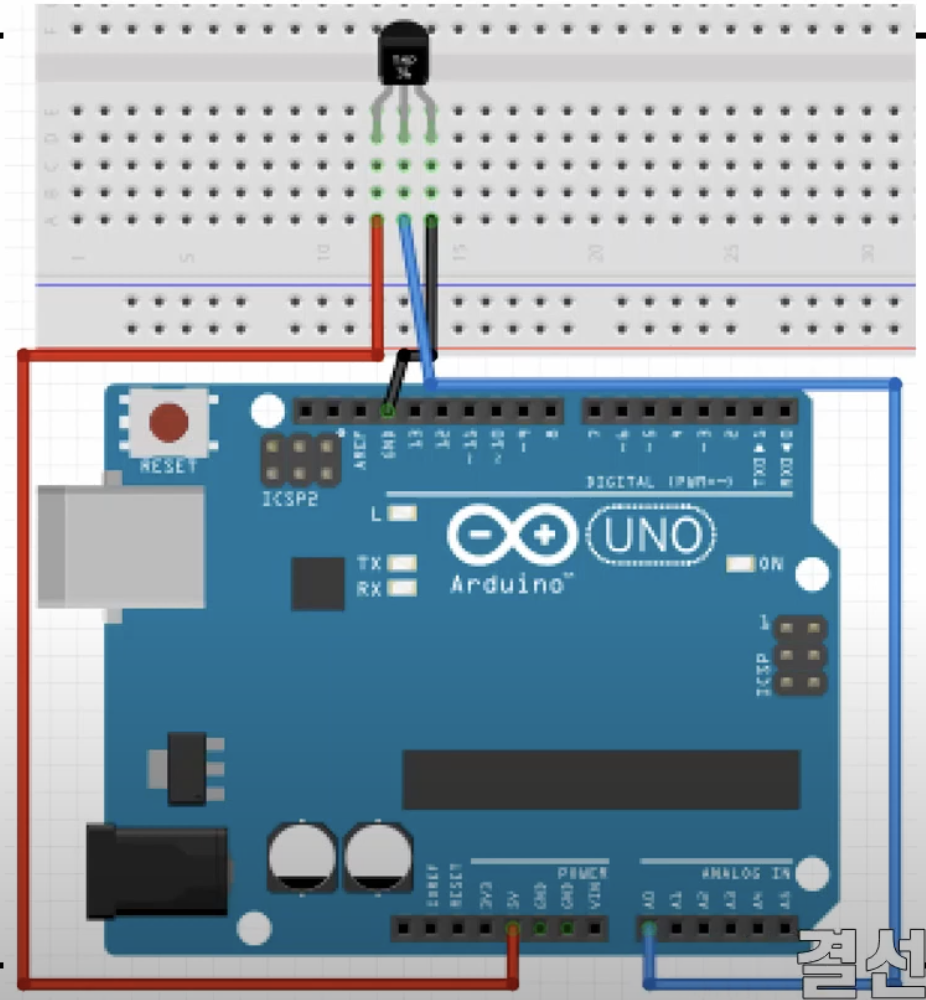

# 실습 #10-1
온도센서를 이용해 주변온도 측정하기

## 필요 물품
- 아두이노 우노보드, USB 케이블
- TMP36 온도센서 1개
- 점퍼선 3개

## 회로 결선

 

# 실습 #10-2 
온도센서와 LED를 이용해 특정 온도에서 특정 색상 LED 점멸 코드  
개인적으로 실습 10-1을 확장시킴

## 필요 물품
- 아두이노 우노보드, USB 케이블
- TMP36 온도센서 1개
- LED 3개
- 330Ω 저항 3개
- 점퍼선 10개

## 회로 결선
#14-1에 추가적으로  
- 7, 4, 2번 핀과 LED 왼쪽다리 연결
- 각 LED의 오른쪽 다리에 330Ω 저항 저항 연결
- LED와 연결되지 않은 330Ω 저항 다리들과 브레드보드의 '-' 연결
