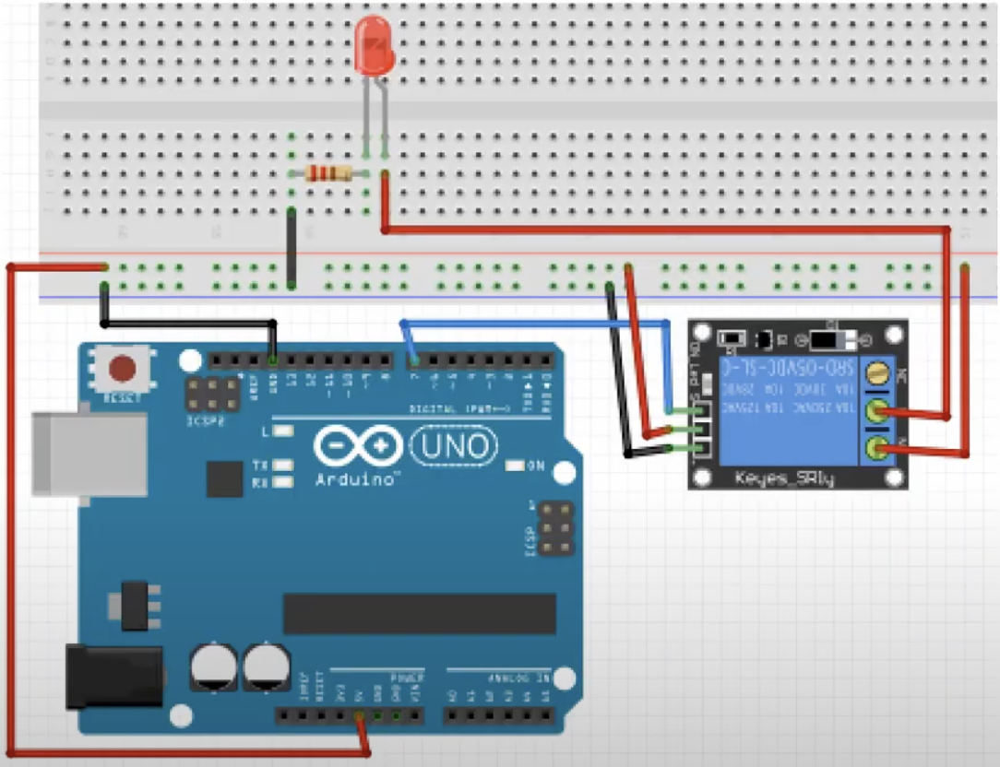

# 실습 #15
소리감지센서의 값 확인

## 필요 물품
- 아두이노 우노보드, USB 케이블
- 릴레이 모듈 1개
- LED, 330Ω 저항 1개씩
- 점퍼선 8개

## 회로 결선

 

1. 아두이노의 5V 핀과 브레드보드의 '+' 연결
2. 아두이노의 GND 핀과 브레드보드의 '-' 연결
3. 릴레이 모듈의 VCC와 브레드보드의 '+' 연결
4. 릴레이 모듈의 GND와 브레드보드의 '-' 연결
5. 릴레이 모듈의 IN과 아두이노의 7번 핀 연결
6. 릴레이 모듈의 NO와 브레드보드의 '+' 연결
7. 릴레이 모듈의 COM과 LED의 긴쪽 다리 연결
8. LED의 짧은 다리와 저항의 한쪽 다리 연결
9. 저항의 다른쪽 다리와 브레드보드의 '-' 연결