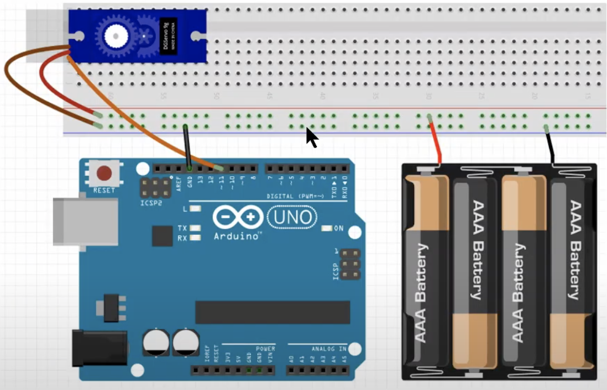

# 실습 #16-1
서보모터 다루기

## 필요 물품
- 아두이노 우노보드, USB 케이블
- 서보모터 1개
- 4구 AA 배터리 홀더 1개
- AA 배터리 4개
- LED, 330Ω 저항 1개씩
- 점퍼선 4개

## 회로 결선

 

※ 회로 결선 전에 배터리 홀더에 베터리는 빼고 결선후 배터리 장착

 

# 실습 #16-2
서보모터 다루기

## 필요 물품
#16-1과 동일

## 회로 결선
#16-1과 동일