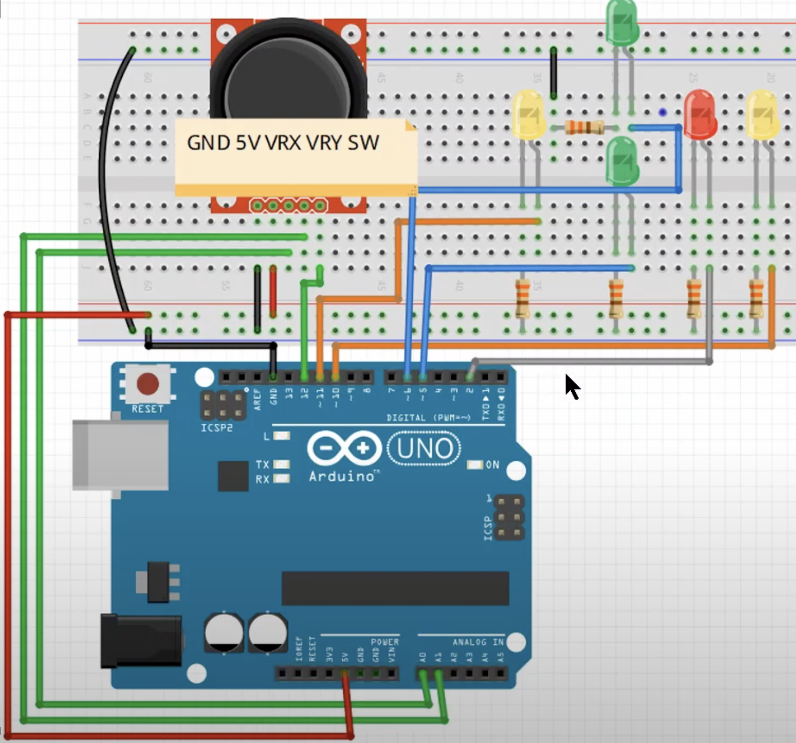

# 실습 #18-1
조이스틱 모듈 사전 작업

## 필요 물품
- 아두이노 우노보드, USB 케이블
- 조이스틱 모듈 1개
- LED, 330Ω 저항 5개씩
- 점퍼선(凸-凸) 8개
- 점퍼선(凹-凸) 5개

## 회로 결선

 

1. 아두이노 5V, GND를 브레드보드의 +, -와 연결
2. 조이스틱의 5V, GND를 브레드보드의 +, -에 연결
3. 조이스틱의 VRX, VRY를 아두이노의 A0, A1에 연결
4. 조이스틱의 SW를 아두이노의 2번 핀에 연결
    - 조이스틱은 (凹-凸)점프선으로 연결해야 임직이기 편함  
5. 같은 색상 LED 2개를 아두이노 11, 10번 (좌, 우) 핀에 연결 
6. 같은 색상 LED 2개를 아두이노 6, 5번 (상, 하) 핀에 연결 
7. 나머지 LED 1개를 아두이노의 2번 핀에 연결
8. 저항은 각각 330Ω 이용

 

# 실습 #18-2
조이스틱 모듈 다루기

## 필요 물품
#18-1과 동일

## 회로 결선
#18-1과 동일