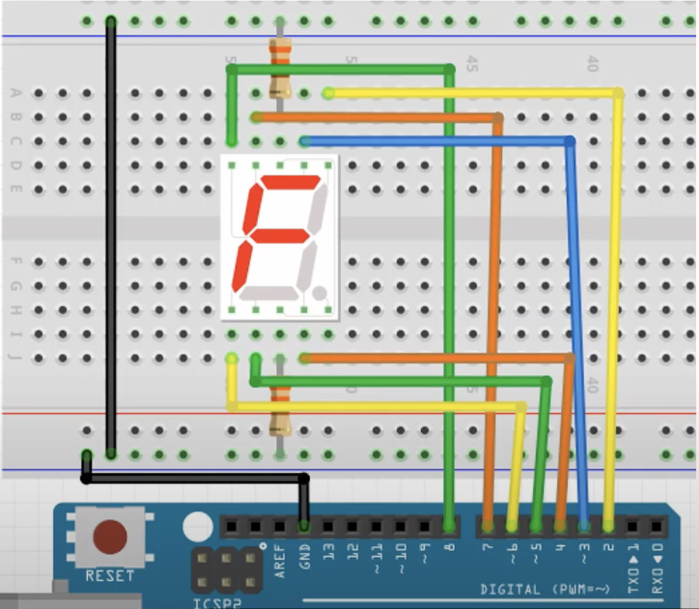

# 실습 #19
7 세그먼트 다루기

## 필요 물품
- 아두이노 우노보드, USB 케이블
- 7 segmanet LED 1개
- LED, 330Ω 저항 2개
- 점퍼선 9개

## 회로 결선

 

1. 아두이노의 GND와 브레드보드의 '-'둘 다 연결
2. 7 seg GND 핀 두개를 330Ω 저항으로 브레드보드의 '-'와 연결
3. 7 seg a, b 핀을 아두이노의 2, 3번 핀과 연결
4. 7 seg c, d, e 핀을 아두이노의 4, 5, 6번 핀과 연결
5. 7 seg f, g 핀을 아두이노의 7, 8번 핀과 연결 