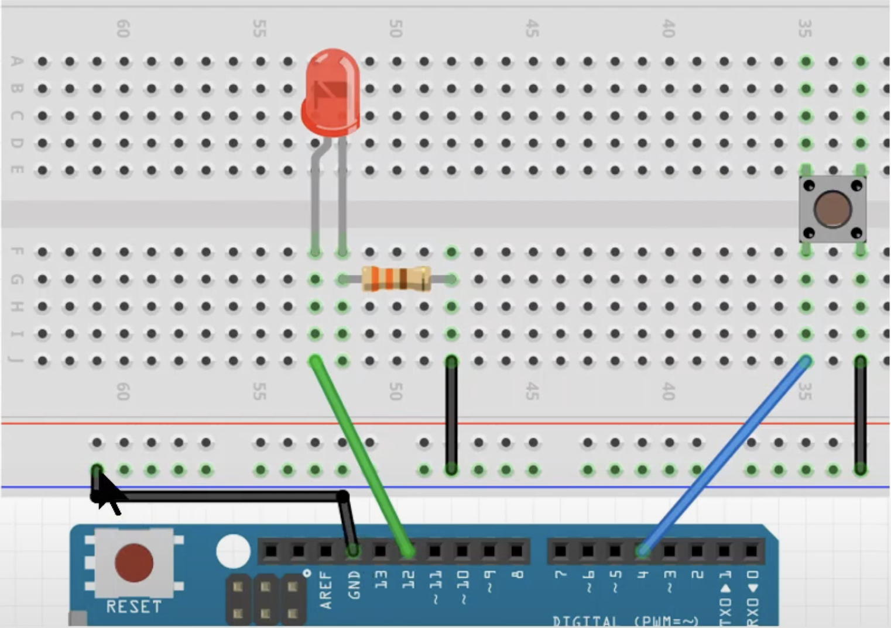
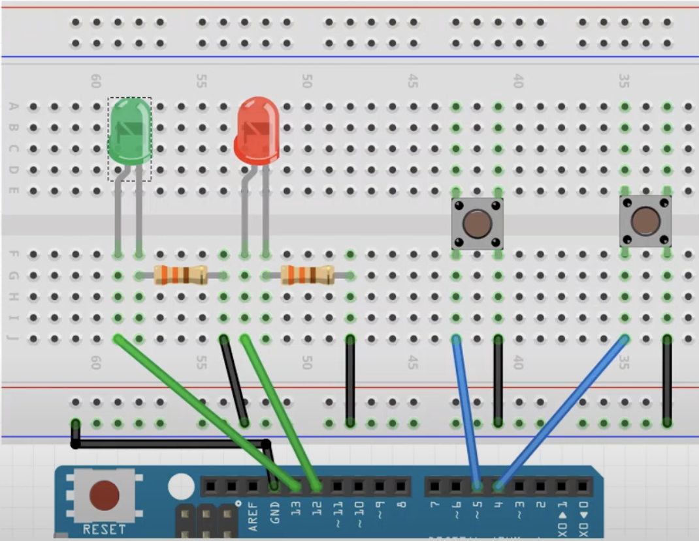

# 실습 #4-1
택트 스위치 1개를 이용한 LED 점등 회로

## 필요 물품
- 아두이노 우노보드, USB 케이블
- LED, 330Ω 저항 1개씩
- 택트 스위치 1개
- 점퍼선 5개

## 회로 결선

 

# 실습 #4-2
택트 스위치 2개를 이용한 LED 점등 회로

## 필요 물품
- 아두이노 우노보드, USB 케이블
- LED, 330Ω 저항 2개씩
- 택트 스위치 2개
- 점퍼선 9개

## 회로 결선
