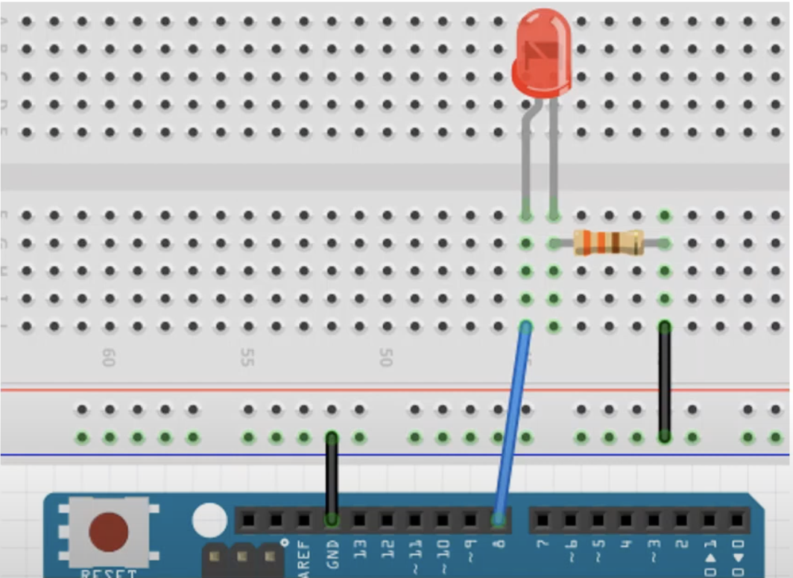
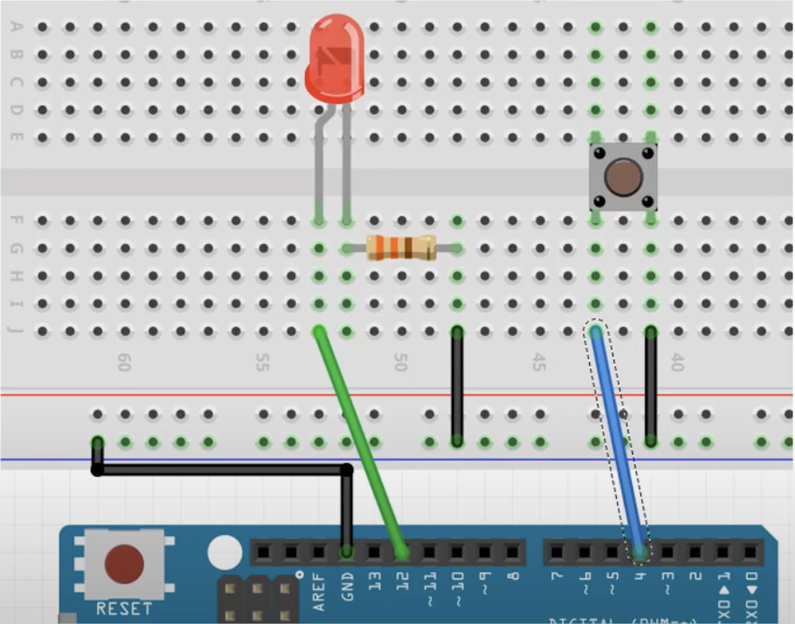

# 실습 #5-1
for문을 while문으로 대체해보기

## 필요 물품
- 아두이노 우노보드, USB 케이블
- LED, 330Ω 저항 1개씩
- 점퍼선 3개

## 회로 결선

 

# 실습 #5-2
if문을 while문으로 대체해보기

## 필요 물품
- 아두이노 우노보드, USB 케이블
- LED, 330Ω 저항 1개씩
- 택트 스위치 1개
- 점퍼선 4개

## 회로 결선
