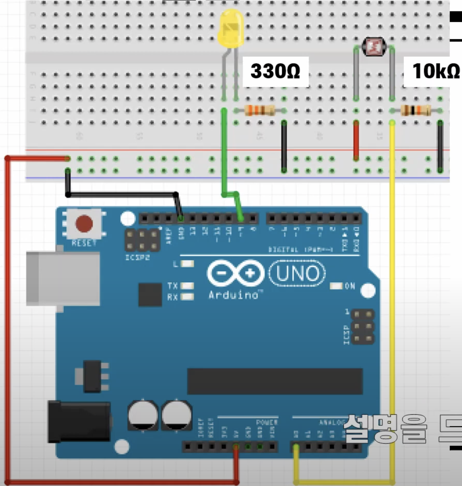

# 실습 #7-1
시리얼 모니터를 이용한 조도센서의 값 확인

## 필요 물품
- 아두이노 우노보드, USB 케이블
- 조도 센서, 10kΩ 저항 1개씩
- LED, 330Ω 저항 1개씩
- 점퍼선 7개

## 회로 결선

1. 아두이노의 5V번 핀과 브레드보드의 '+' 연결
 
2. 아두이노의 GND핀과 브레드보드의 '-' 연결
 
3. 아두이노의 9번 핀과 LED 연결
 
4. 조도센서의 왼쪽 다리와 브레드보도의 '+' 연결
 
5. 조도센서의 오른쪽 다리와 10kΩ 저항의 한쪽 연결
 
6. 조도센서의 오른쪽 다리와 아두이노의 A0핀 연결
 
7. 10kΩ 저항의 다른 한쪽과 브레드보드의 '-' 연결

 

# 실습 #7-2
조도 적응형 LED 조명

## 필요 물품
#7-1과 동일

## 회로 결선
#7-1과 동일